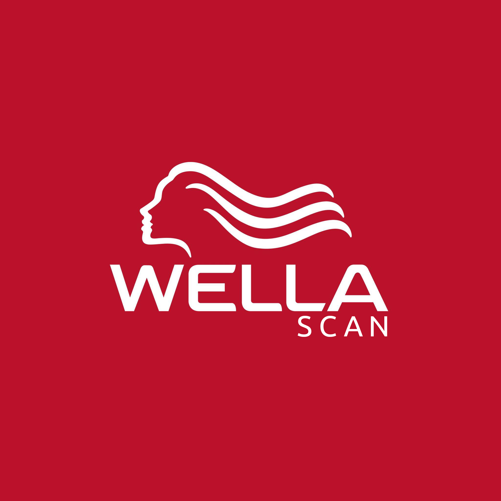
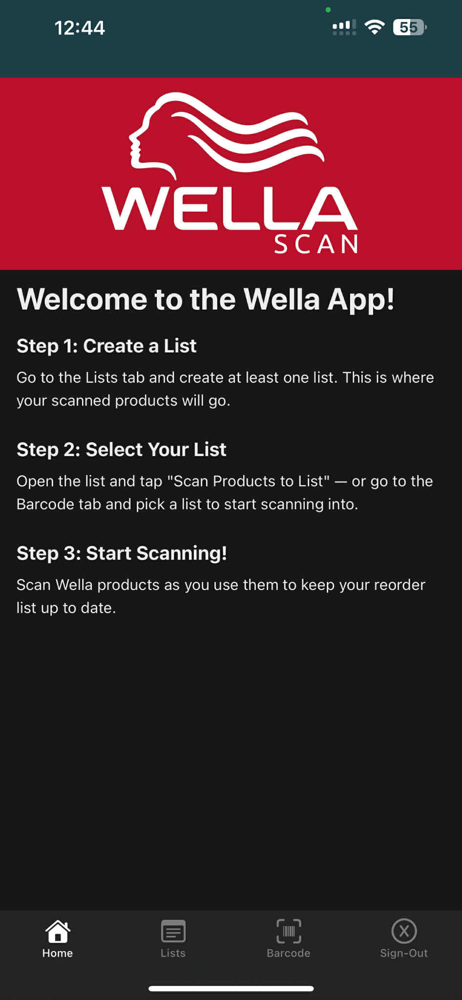
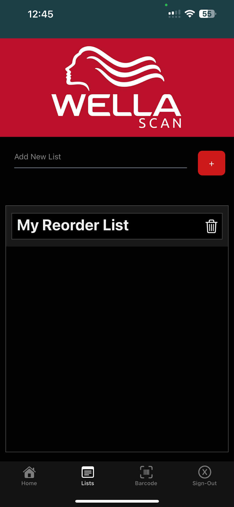
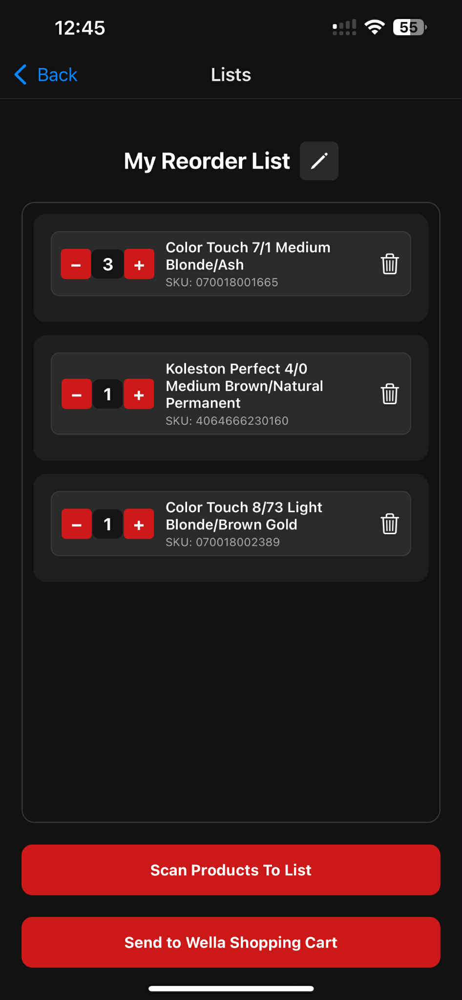
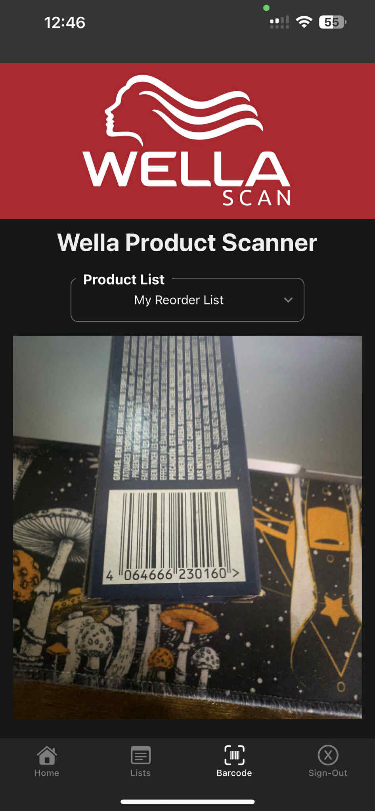
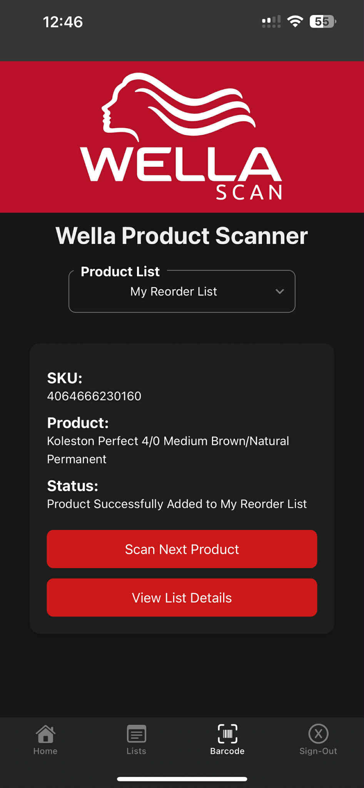
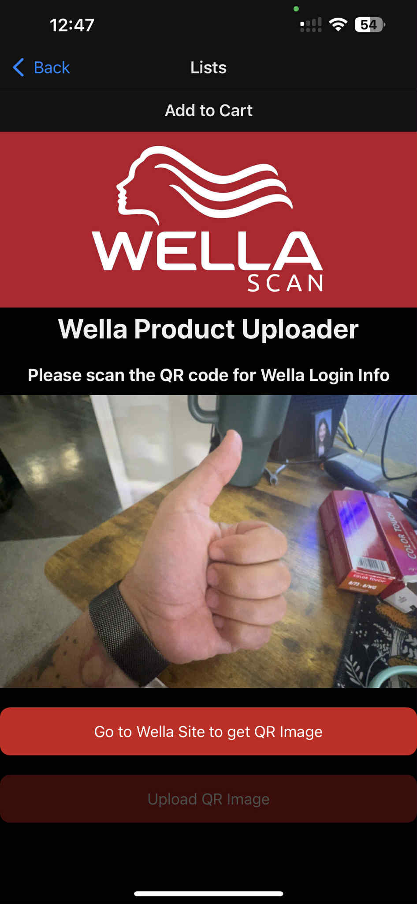
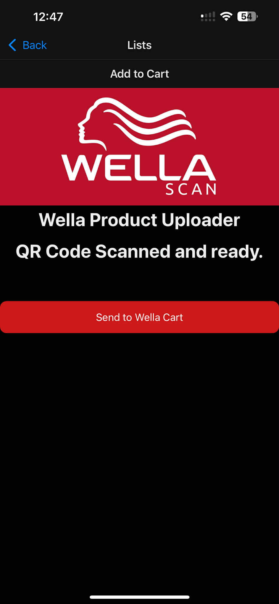
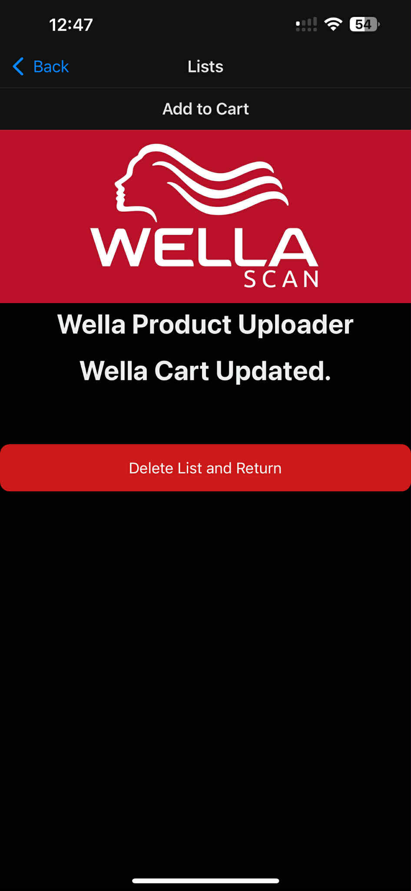

# WellaScan

WellaScan is a React Native app designed to streamline the product reordering process for salon professionals who use
Wella products. The idea began after noticing my girlfriend’s routine of saving color boxtops in her salon and manually
reordering products each month. This app aims to make that process seamless.

With WellaScan, users can scan Wella product barcodes (EANs) as they use them, building a reorder list throughout the
month. Using a Tampermonkey script installed in a web browser (with mobile browser support coming soon), users can log
in to their Wella account and generate a QR code. This QR code can then be scanned by the WellaScan app to securely
upload the scanned items and quantities directly into their Wella shopping cart.

## SlideShow Demo

